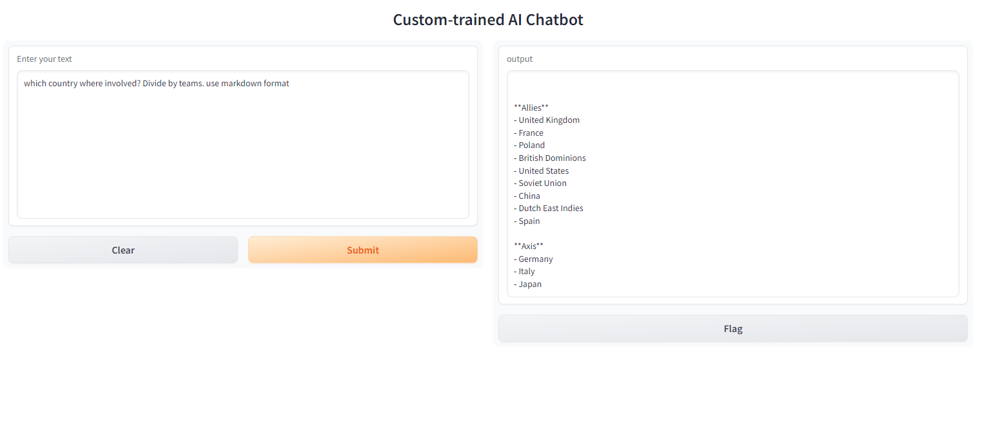

## Dependencies

- Install **Python 3**
- Install **Pip**


## Install env
- pip install virtualenv

## Create env

```bash
python3 -m venv env
````

## Activate env

```bash
source env/bin/activate
``` 

```bash
.\env\Scripts\activate # windows
```

## Install dependencies

```
pip install -r requirements.txt
``` 

## Put any file inside docs/ folder

Sample: [docs/ww2.pdf](docs/ww2.pdf.png)

Supported file loaders
```
".pdf": PDFParser(),
".docx": DocxParser(),
".pptx": PptxParser(),
".jpg": ImageParser(),
".png": ImageParser(),
".jpeg": ImageParser(),
".mp3": VideoAudioParser(),
".mp4": VideoAudioParser(),
".csv": PandasCSVParser(),
".epub": EpubParser(),
".md": MarkdownParser(),
".mbox": MboxParser(),
```


## Start

```
python3 app.py
```

Navigate to: http://127.0.0.1:7860


